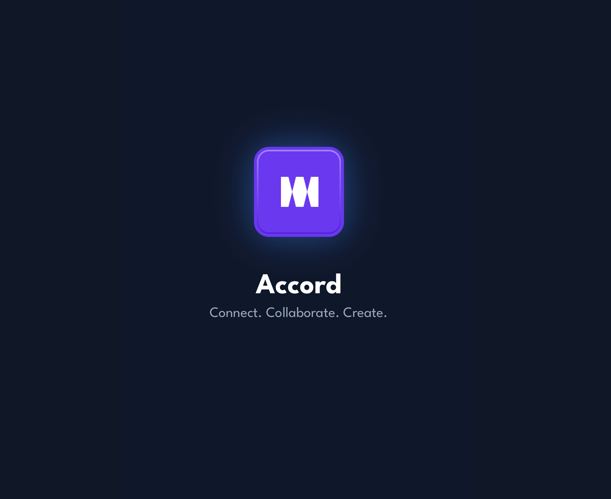
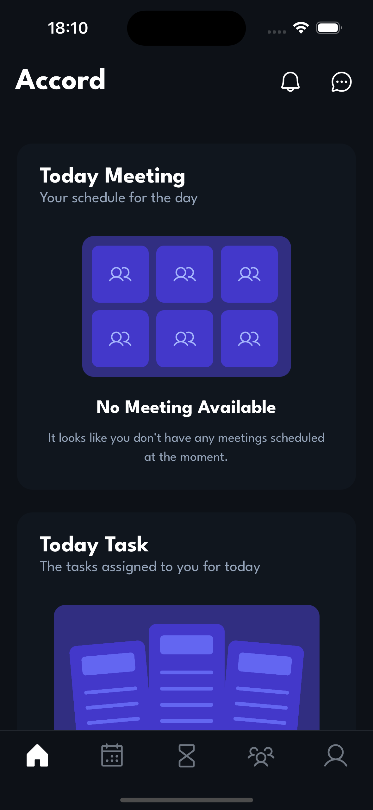
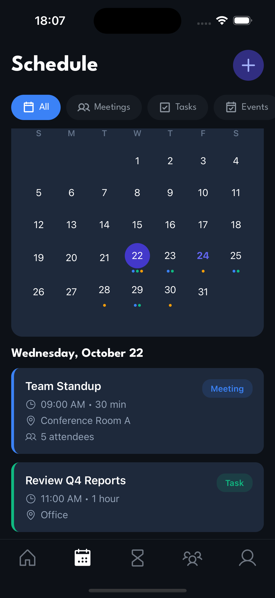
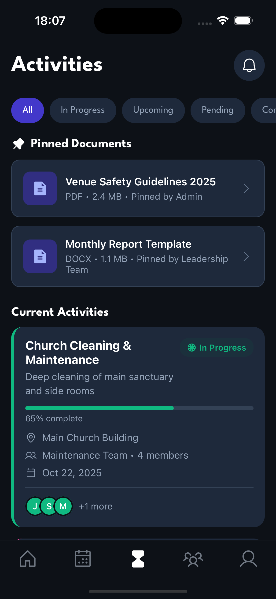

# Accord

<!-- Banner placeholder - Replace with your app banner image -->



> A venue-based community platform that connects people within shared spaces, enabling seamless communication, event coordination, and collaboration.

## 📱 Screenshots

<!-- Add your app screenshots here -->
<p align="center">
  
  
  
</p>

## ✨ Features

- **🏢 Venue-Based Communities** - Users are organized by venue, creating isolated, private social networks for each location
- **👥 Member Directory** - Browse and connect with people in your venue
- **💬 Messaging** - Direct messages and group chats with venue members
- **📅 Event Management** - Create, discover, and RSVP to venue events and activities
- **🎯 Activity Tracking** - Track maintenance, programs, events, and outreach activities
- **👤 User Profiles** - View member profiles with organization details and contact options
- **🔔 Real-time Updates** - Stay informed about venue activities and announcements
- **🌓 Dark Mode** - Beautiful dark and light theme support

## 🛠️ Tech Stack

- **Framework:** React Native with Expo SDK 54 (LTS)
- **Language:** TypeScript
- **Styling:** NativeWind (TailwindCSS for React Native)
- **Icons:** Phosphor Icons
- **Navigation:** React Navigation
- **Package Manager:** Yarn

## 📋 Prerequisites

Before you begin, ensure you have the following installed:

- **Node.js** (v18 or v20 recommended)
- **Yarn** package manager: `npm install -g yarn`
- **Expo CLI**: `npm install -g expo-cli`
- **iOS Simulator** (macOS) or **Android Studio** (for Android development)

## 🚀 Getting Started

### Installation

1. **Clone the repository**

   ```bash
   git clone https://github.com/yourusername/accord.git
   cd accord
   ```

2. **Install dependencies**

   ```bash
   yarn install
   ```

3. **Start the development server**

   ```bash
   npx expo start
   ```

4. **Run on your device**
   - **iOS:** Press `i` in the terminal or scan the QR code with your iPhone's camera
   - **Android:** Press `a` in the terminal or scan the QR code with the Expo Go app
   - **Web:** Press `w` in the terminal

### Environment Setup

Create a `.env` file in the root directory:

```env
API_BASE_URL=your_api_url_here
# Add other environment variables as needed
```

## 🎯 Core Concepts

### Venue Isolation

- Each venue operates as an independent community
- Users can only see and interact with members of their assigned venue
- Admins manage venue creation and user assignments

### Activity Types

- **Maintenance** - Cleaning, repairs, upkeep tasks
- **Events** - Guest visits, special programs, celebrations
- **Programs** - Youth activities, workshops, classes
- **Outreach** - Community engagement initiatives

## 🧪 Testing

```bash
# Run tests
yarn test

# Run tests in watch mode
yarn test:watch

# Run tests with coverage
yarn test:coverage
```

## 📦 Building for Production

### Android

```bash
# Build APK
eas build --platform android --profile preview

# Build AAB for Google Play
eas build --platform android --profile production
```

### iOS

```bash
# Build for TestFlight
eas build --platform ios --profile production
```

## 🤝 Contributing

Contributions are welcome! Please follow these steps:

1. Fork the repository
2. Create a feature branch: `git checkout -b feature/amazing-feature`
3. Commit your changes: `git commit -m 'Add amazing feature'`
4. Push to the branch: `git push origin feature/amazing-feature`
5. Open a Pull Request

## 📄 License

This project is licensed under the MIT License - see the [LICENSE](LICENSE) file for details.

## 👥 Authors

- **Your Name** - [Your GitHub](https://github.com/limitify-dev)

## 📞 Contact

- **Email:** team@limitify.rw
- **Project Link:** [https://github.com/limitify-dev/Accord](https://github.com/limitify-dev/Accord)

## 🙏 Acknowledgments

- Thanks to all contributors who have helped shape Accord
- Built with [Expo](https://expo.dev/)
- Icons by [Lucide](https://lucide.dev/) and [Phosphor Icons](https://phosphoricons.com/)

---

Made with dedication for building better communities
